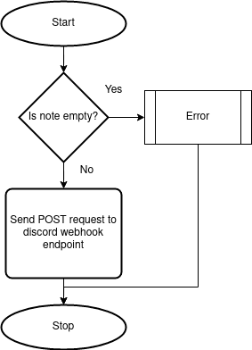

# 3. Use Discord Webhooks

Date: 2023-04-06

## Status

Accepted

## Context

We identified the need for a notification system when a new note was added. We could implement the notification system manually or there are APIs we can leverage to handle the heavy lifting for us, like Discord webhooks or Slack Webhooks.
 
## Decision

Implement Discord webhooks to handle notifications whenever a note is added.
The following flowchart illustrates the algorithm used for handling notifications

## Consequences

- Keeping up with any security issues in the discord API
- Consistent way of sending notifications 
